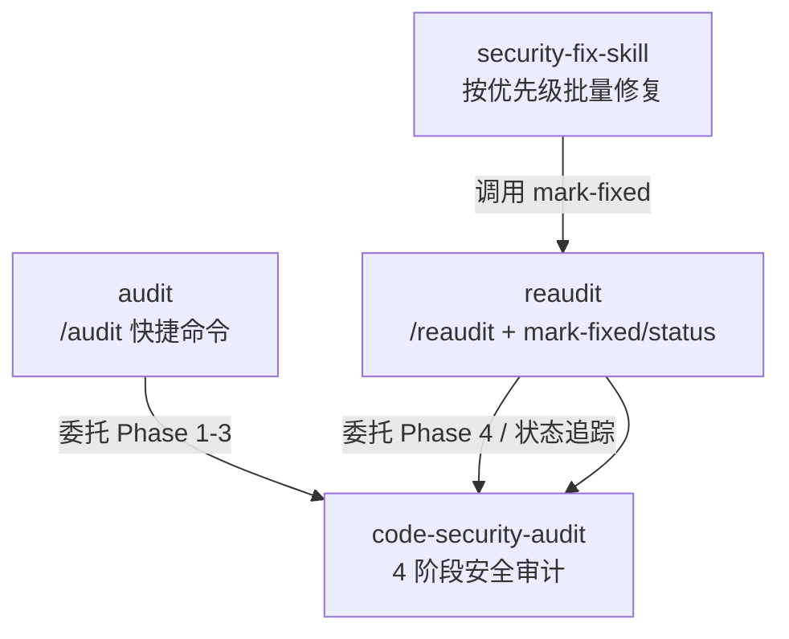
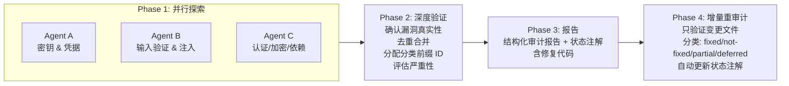

# Code Security Skills

> Claude Code 插件 — 系统化代码安全审计技能集，覆盖漏洞发现、验证、报告、修复、重审计全流程。**v1.1.0**

## 技能概览



| 技能 | 触发方式 | 功能 |
|------|----------|------|
| `code-security-audit` | "audit this repo", "安全审计" | 系统安全审计：并行探索 → 验证 → 报告 → 增量重审计 |
| `audit` | `/audit` | 快捷入口，委托到 code-security-audit Phase 1-3 |
| `reaudit` | `/reaudit`, "再审计" | **v1.1 新增**：全量/增量重审计、`mark-fixed`、`mark-deferred`、`status` |
| `security-fix-skill` | "/security-fix", "修安全漏洞" | 按 P1-P4 优先级批量修复，每批自动更新 finding 状态 |

## v1.1.0 新特性

### 状态追踪

每个 finding 现在包含机读状态注解：

```markdown
### SSRF-1 — tool_fetch_url 无 URL 校验
<!-- AUDIT:STATUS=fixed SEVERITY=high FILE=_core.py LINES=2713-2834 COMMIT=6ca5089 -->
```

**轻量操作**（不改代码，只改注解行）：
| 命令 | 作用 |
|------|------|
| `/reaudit mark-fixed SSRF-1` | 标记为已修复 |
| `/reaudit mark-deferred M4` | 标记为结构性延期 |
| `/reaudit status` | 显示修复进度（3 fixed / 2 open / 1 deferred） |

### 稳定 Finding ID

使用分类前缀替代顺序编号。新增 finding 不会改变已有 ID：

| 前缀 | 类别 | 示例 |
|------|------|------|
| `SSRF` | SSRF / URL 注入 | `SSRF-1`, `SSRF-2` |
| `PATH` | 路径穿越 | `PATH-1` |
| `AUTH` | 鉴权缺失 | `AUTH-1` |
| `CMD` | 命令注入 | `CMD-1` |

### 增量 Re-audit

Phase 4 不再全量重读所有文件。通过 `git diff <audit-commit>..HEAD` 只验证变更文件中的 finding，未变更文件的 finding 自动跳过。

### Phase 2 去重

3 个 Agent 经常重复报同一问题——Phase 2 现在自动合并同文件/同行范围的重复发现。

## 安装

**要求：** Claude Code >= 1.0.37（支持插件系统）

### 方式一：从 GitHub 安装（推荐）

```bash
claude plugins install https://github.com/Azzygoatcoder/code-security-skills
```

Claude Code 会自动克隆仓库并注册 `skills/` 目录下的全部技能。安装后重启 Claude Code 会话即可生效。

### 方式二：手动安装

将 `skills/` 下各技能目录复制或符号链接到用户级技能目录：

#### macOS / Linux

```bash
ln -s "$(pwd)/skills/code-security-audit" ~/.claude/skills/code-security-audit
ln -s "$(pwd)/skills/audit" ~/.claude/skills/audit
ln -s "$(pwd)/skills/reaudit" ~/.claude/skills/reaudit
ln -s "$(pwd)/skills/security-fix-skill" ~/.claude/skills/security-fix-skill
```

#### Windows (PowerShell)

```powershell
New-Item -ItemType Junction -Path "$env:USERPROFILE\.claude\skills\code-security-audit" -Target "$pwd\skills\code-security-audit"
# 对 audit、reaudit、security-fix-skill 重复
```

### 验证安装

安装后，在 Claude Code 中输入以下命令确认技能已加载：

```bash
/audit    # 应触发安全审计流程
/reaudit  # 应触发重审计流程
```

或直接说 "audit this repo" 测试自然语言触发。

## 审计工作流



3 个并行 Explore agent 各司其职、独立搜索，Phase 2 去重合并。**覆盖范围远超单一 agent 的广度审计。**

## 漏洞覆盖

17 类漏洞模式，每类提供 grep 搜索模式、典型漏洞代码形态、修复代码模板、CVSS 评分参考：

| 类别 | 类别 | 类别 |
|------|------|------|
| 路径遍历 | XSS | SQL 注入 |
| 命令注入 | SSRF | 不安全反序列化 |
| CSRF/CORS | 文件权限 | 明文凭据 |
| 子进程注入 | 认证与会话 | 加密弱点 |
| 依赖管理 | 临时文件处理 | 环境变量泄露 |
| 日志伪造 | 竞态条件 (TOCTOU) | — |

## 优势

### 并行化设计，减少审计盲区

传统单 agent 审计受限于单一的搜索策略和思维模型。本技能集采用 3 个独立 agent 并行扫描——密钥凭据、输入验证与注入、认证加密依赖——每个 agent 使用不同的 grep 模式和心理模型，覆盖彼此盲区。

### 4 阶段递进，每步有明确产出

不是"让 AI 扫一遍就出报告"。探索 → 验证 → 报告 → 重审计，阶段间有明确的质量门：

- **Phase 1**：覆盖广度（3 agent 并行）
- **Phase 2**：覆盖深度（人工核实每条发现）
- **Phase 3**：结构化交付（含修复代码的完整报告）
- **Phase 4**：闭环验证（确认修复到位、无回归）

### 可演进的漏洞知识库

`vulnerability-patterns.md` 不是静态的检查清单——每次审计后补充新发现的漏洞模式，grep 模式持续丰富，修复模板持续完善。**技能随着使用变强。**

### 正交分工，组合灵活

- 快速审计：`/audit`
- 全面审计 + 修复：`code-security-audit` → `security-fix-skill`
- 验证修复：`/reaudit`
- 持续集成：将 audit 作为发布前检查步骤

### 实战验证

`security-fix-skill` 的工作流在真实 Python Web 应用项目中打磨，历经 16 个真实漏洞发现和修复（P1-P4），覆盖路径遍历、命令注入、XSS、CSRF、SSRF、明文凭据等。

## 待改进

### 语言覆盖

`vulnerability-patterns.md` 的 grep 模式和代码示例目前偏重 Python 和 JavaScript。Go、Rust、Java、C# 的特定模式尚待补充。

### SAST 工具集成

当前纯靠 LLM agent 的语义理解和 grep 搜索。未来可集成 semgrep、CodeQL 等 SAST 工具作为 Phase 1 的补充信号源，提高低层漏洞（硬编码密钥、不安全函数调用）的检出率。

### 输出格式

审计报告目前仅输出 Markdown。可考虑支持 SARIF 格式（GitHub Code Scanning 兼容）或 JSON，方便接入 CI/CD 流水线。

### 自动化测试与 Eval 基准

技能的 SKILL.md 内容变更后，缺乏自动化验证手段——无法确认改动的 prompt 是否仍然产生一致的审计质量。未来可建立 eval 基准（含已知漏洞的样例仓库），量化变更对审计召回率和精确率的影响。

### 依赖校验

4 个技能间通过 `name` 字段字符串引用（如 "load and follow `code-security-audit`"），缺少编译时校验。如果父技能改名，子技能会在运行时而非加载时暴露问题。

## 版本历史

| 版本 | 日期 | 变更 |
|------|------|------|
| **1.1.0** | 2026-06-18 | 状态追踪注解、分类前缀 ID、增量 re-audit、Phase 2 去重、mark-fixed/status 轻量操作 |
| **1.0.0** | 2026-06-14 | 初始版本：4 阶段审计、17 类漏洞模式、批量修复工作流 |

## 许可证

[MIT](LICENSE)
